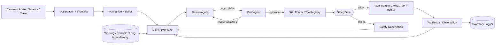
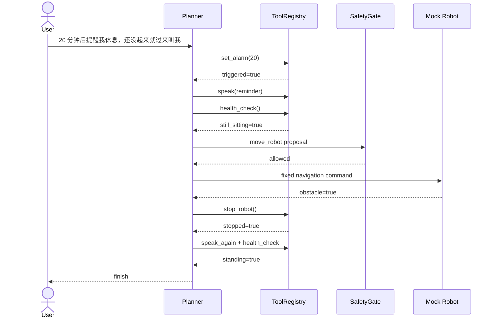
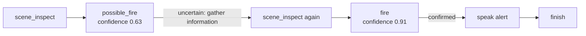

# Guidebot — Multimodal Agent Runtime for Physical Environments

[](https://www.python.org/)
[](#验证与测试)

Guidebot 起源于树莓派视觉小车原型，已经分别验证语音交互、视觉场景理解、人体状态检测、闹钟移动
和超声波挡停。当前仓库的重点不是增加机器人功能，而是把这些能力封装成可规划、可审计、可重放的
多模态 Agent Runtime。

> An interview-oriented, safety-first Agent Runtime that turns separately validated robot
> capabilities into bounded tool-use workflows with planning, critique, memory and replay.

## 30 秒看懂项目

| 面试能力点 | Guidebot 中的落地 |
|---|---|
| Agent Framework | 有界 ReAct-style `AgentLoop`，ToolResult 自动回到下一轮 Observation |
| Tool Calling | 统一异步 Tool、JSON Schema、白名单 Registry、结构化错误 |
| Safe Embodied AI | LLM 只做 high-level planning，物理动作由独立 SafetyGate 决定权限 |
| Memory / Context | Working、Episodic、Long-term Memory；最近 6 步 + 旧轨迹摘要 |
| Multi-Agent | 只保留 Planner/Critic，最多修订 2 次，避免无限讨论 |
| Evaluation | Mock Tool 与事件 Replay，无摄像头、模型 API 或真实小车也能复现 |

## 验证范围

Hardware validated（已有脚本在真实小车上分别验证）：

- Qwen Omni 实时语音交互；
- VLM 摄像头场景理解与异常播报；
- YOLOv8 久坐/疲劳检测；
- 闹钟触发移动；
- 超声波障碍检测与立即停止。

Software / mock validated（新 Agent Runtime 在 VSCode、Mock Tool、Replay 中验证）：

- 统一 Tool Registry 与 JSON Schema；
- 有 `max_steps` 的 Planner/Tool/Observation AgentLoop；
- PlannerAgent 与独立 CriticAgent；
- SafetyGate 物理动作拦截；
- Working、Episodic、Long-term 三层 Memory；
- 最近 6 步上下文与确定性旧轨迹摘要；
- break-reminder 多步任务与 fire-verify 主动感知 Replay。

**没有声称新的多步 AgentLoop 已整体部署到真实机器人。** 真实能力通过 wrapper 注入，新流程目前使用
Mock Tool 和历史事件重放验证。

## 主架构



LLM 只生成高层工具调用，例如 `scene_inspect`、`health_check`、`move_robot`。导航、motor PID、YOLO、
ASR、VLM 调用和超声波停止逻辑仍由固定实现负责，不能由 LLM token-by-token 生成。

## 快速开始

要求 Python 3.10+，核心 Runtime 没有重型依赖。

```bash
cd /workspace/ylj/harry_main/Guidebot
python3 -m venv .venv
. .venv/bin/activate
pip install -e '.[dev]'

pytest
guidebot demo break-reminder
guidebot demo fire-verify
guidebot replay data/replays/fire_verify.json
```

### Demo 1：休息提醒与安全挡停

```bash
guidebot demo break-reminder
```

Mock 环境执行：



### Demo 2：明火二次确认

```bash
guidebot replay data/replays/fire_verify.json
```

Replay 执行：



第一次证据处于不确定区间时不会直接报警，而是选择 information gathering。Replay 只是软件事件重放，
不是 Gazebo、Isaac Sim 或物理仿真。

### 原有命令保持兼容

```bash
guidebot demo
guidebot serve --no-voice --mock-sensors
guidebot voice-qwen --voice Tina
guidebot scene scan --label fire --json
guidebot health check --sedentary --json
guidebot alarm set --time '07:00' --json
guidebot simulate
guidebot evolve --dry-run
```

## Tool Registry

统一 Tool 接口包含：

```text
name + description + JSON schema + async execute(**kwargs) -> ToolResult
```

正式 wrapper：`VoiceChatTool`、`SceneInspectTool`、`HealthCheckTool`、`SetAlarmTool`、`SpeakTool`、
`MoveRobotTool`、`StopRobotTool`。

Mock 实现：`MockSceneInspectTool`、`MockHealthCheckTool`、`MockAlarmTool`、`MockRobotTool`。真实 Tool
只包装现有 Omni/VLM/YOLO/小车适配器，不重写模型和硬件逻辑。所有 planner 调用都必须经过
`ToolRegistry`，未知 Tool、错误参数和适配器异常会转成明确失败。

## AgentLoop 与安全边界

Planner 严格输出：

```json
{
  "type": "tool_call",
  "reason": "用户仍在久坐，需要检查后决定是否靠近",
  "tool_name": "health_check",
  "arguments": {"check": "posture"},
  "final_answer": null
}
```

Critic 在执行前检查 Tool 是否存在、参数是否符合 schema、是否存在明显安全问题，以及 finish 时是否
缺少关键步骤。SafetyGate 再独立执行 fail-closed 检查：障碍存在或移动时长无效时拒绝移动，
`stop_robot` 始终具有最高安全语义。Planner、Critic 和离线 self-evolution 都不能修改 SafetyGate。

## Memory 与上下文压缩

- `WorkingMemory`：`deque(maxlen=6)` 保存当前任务最近步骤；
- `EpisodicMemory`：append-only JSONL 保存完整任务轨迹；
- `LongTermMemory`：保存稳定信息，支持 update、supersede 和 active filtering；
- `ContextManager`：保留最近 6 步细节，把更旧步骤压缩成 deterministic digest；
- 检索第一版仅使用关键词重合、时间新近度和 importance，不引入向量数据库。

## 验证与测试

```bash
pytest -q
# 153 passed
```

核心测试覆盖 Registry、未知 Tool、schema 错误、工具失败回传、`max_steps`、Critic 修订、障碍挡停、
三层 Memory、上下文压缩、break-reminder 和 fire Replay。测试不访问摄像头、Omni/VLM API 或小车。

## 目录

```text
src/guidebot/
  tools/                    # Tool、ToolResult、Registry、真实 wrapper、Mock Tool
  runtime/
    agent_loop.py           # 有界 Planner → Tool → Observation 循环
    context_manager.py      # recent 6 steps + old digest + memory
    state.py                # Observation、Step、AgentRunResult
    event_runtime.py        # 原有 EventBus 常驻 runtime，兼容旧接口
  planning/
    planner.py              # strict JSON PlannerAgent / MockPlanner
    critic.py               # CriticAgent / AgentMessage
    options.py              # 原有 high-level Options 编译器
  memory/                   # Working / Episodic / Long-term / retrieval
  replay.py                 # 轻量 JSON observation replay
  modules/                  # 原有 voice/scene/health/alarm/mobility wrapper 边界
data/replays/fire_verify.json
INTERVIEW_ARCHITECTURE.md
```

## Self-evolution 的定位

`reflection.py`、`policy_evolution.py`、`self_evolving.py` 保留为 experimental offline improvement：

```text
episode → reflection → candidate skill → held-out validation → optional approval
```

生产 Runtime 只加载批准过的 Skill。当前不会自动修改生产策略，不做 PPO/GRPO、RL、world model、
自动生产自修改，也不引入 ROS2、Gazebo、Isaac Sim、Kubernetes、Redis、Milvus、Neo4j 或 Kafka。

面试讲解见 [INTERVIEW_ARCHITECTURE.md](INTERVIEW_ARCHITECTURE.md)。树莓派语音与已有硬件接入细节见
[docs/realtime-voice-deployment.md](docs/realtime-voice-deployment.md) 和
[docs/car-compatibility.md](docs/car-compatibility.md)。
